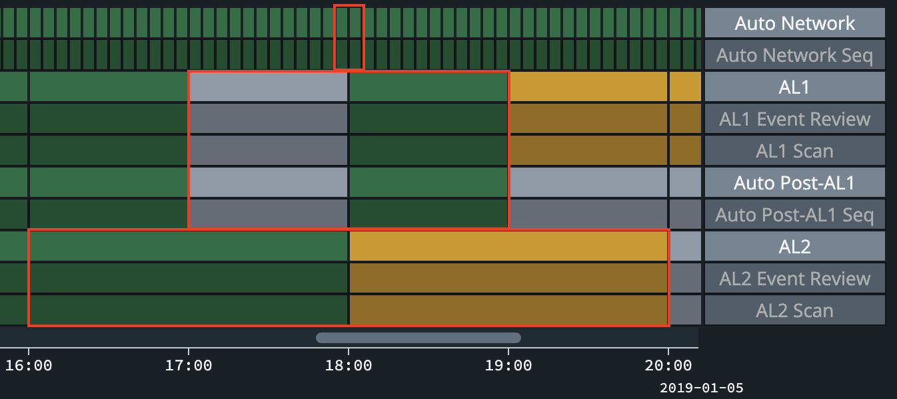

The GMS SME Team developed these request and response answer keys for five interval "endpoints" requested from the DAL.

# Interval Domain Answer Key Descriptions
POC: Nicole McMahon, SNL, nmcmaho@sandia.gov<br>
Updated: 17-Mar-24

#### File Name Stucture 
Skeleton: {time_format}/{endpoint}\_{test \#}_[request,response].{file extension}

- **{time_format}** corresponds to requests/responses in ISO-8601 format or epoch TIMESTAMP format
- **{endpoint}** corresponds to the "Domain Priority" number in the endpoint priority spreadsheet
- **{test \#}** corresponds to a test case
- **{request}** corresponds to some sort of input needed to create the response; this can be JSON request bodies sent to an endpoint or text files information needed to produce the output
- **{response}** corresonds to output generated from the request

## IV-0 - /workflow/query/time
Retrieves the Workflow in effect for the provided time, or for the current time if no time is provided.

#### Request Body
An ISO-8601 date and time or epoch TIMESTAMP.

#### Response Body
The Workflow object that should be returned.

#### Notes
- The request body in iv-0_test2 is intentionally left empty and should retrieve the current version of the Workflow Definition


## IV-1 - /workflow/interval/stage/query/stage-ids-timerange
Retrieves a collection of a StageIntervals with Stage identifiers defined in the request body and overlapping the time range in the query.

#### Request Body
The *startTime* and *endTime* in the request should target 8 Stage intervals and associated sequences/activities (see screenshot of GMS's current Workflow Display with targeted intervals outlined in red):
- 2 Auto Network intervals, each 5mins in length
- 2 AL1 intervals, each 1 hr in length
- 2 Auto Post-AL1 intervals, each 1hr in length
- 2 AL2 intervals, each 2hrs in length


#### Response Body
- The *effectiveAt* attributes in the StationGroup entity version references are not populated at this time, but will be in a future delivery
- The *effectiveForTimeRequest* attributes should reflect the current wall-clock time when the request is sent and may differ from this answer key
- For AUTOMATIC intervals, if processing is complete (i.e., *percentComplete* = 1.0), the *lastExecutedStepName* has been removed)


## IV-2 - /workflow/interval/stage/query/ids
Retrieves specific Stage Intervals with Stage identifiers defined in the request body.

#### Response Body
- The *effectiveAt* attributes in the StationGroup entity version references are not populated at this time, but will be in a future delivery
- The *effectiveForTimeRequest* attributes should reflect the current wall-clock time when the request is sent and may differ from this answer key
- For the AUTOMATIC interval, processing is complete (i.e., *percentComplete* = 1.0), and the *lastExecutedStepName* has been removed

#### Notes
- **Test #2**: before sending the request, make this update to the AL1.NETMAG table using the following command which should in turn update the PIPELINE_METRICS table
    ```sql
    UPDATE al1.netmag SET magnitude = 9.1 WHERE magid = 38555220;
    COMMIT;
    ```
  to revert
  ```sql
  UPDATE netmag SET magnitude = 5.7397726 WHERE magid = 38555220;
  COMMIT;
  ```

- **Test #3**: before sending the request, make these updates to the INTERVAL table uing the following commands
    ```sql
    UPDATE INTERVAL SET state = 'done' WHERE intvlid = 1002432493784;
    INSERT INTO interval (INTVLID,CLASS,NAME,TIME,ENDTIME,STATE,AUTH,PERCENT_AVAILABLE,PROC_START_DATE,PROC_END_DATE,MODDATE,COMMID,LDDATE) VALUES (5555555555555,'NET','NDCS1',1546734600,1546735500,'failed','-',1,to_date('06-JAN-19 00:50:00','DD-MON-RR HH24:MI:SS'),to_date('06-JAN-19 00:50:00','DD-MON-RR HH24:MI:SS'),to_date('06-JAN-19 00:50:00','DD-MON-RR HH24:MI:SS'),-1,to_date('06-JAN-19 00:50:00','DD-MON-RR HH24:MI:SS'));
    INSERT INTO interval (INTVLID,CLASS,NAME,TIME,ENDTIME,STATE,AUTH,PERCENT_AVAILABLE,PROC_START_DATE,PROC_END_DATE,MODDATE,COMMID,LDDATE) VALUES (6666666666666,'ARS','AL1',1546736400,1546740000,'active','-',1,to_date('06-JAN-19 02:05:00','DD-MON-RR HH24:MI:SS'),to_date('06-JAN-19 02:05:00','DD-MON-RR HH24:MI:SS'),to_date('06-JAN-19 02:05:00','DD-MON-RR HH24:MI:SS'),-1,to_date('06-JAN-19 02:05:00','DD-MON-RR HH24:MI:SS'));
    INSERT INTO interval (INTVLID,CLASS,NAME,TIME,ENDTIME,STATE,AUTH,PERCENT_AVAILABLE,PROC_START_DATE,PROC_END_DATE,MODDATE,COMMID,LDDATE) VALUES (7777777777777,'AUTO','AL1',1546736400,1546740000,'arrbeamSP-start','-',1,to_date('06-JAN-19 02:05:00','DD-MON-RR HH24:MI:SS'),to_date('06-JAN-19 02:05:00','DD-MON-RR HH24:MI:SS'),to_date('06-JAN-19 02:05:00','DD-MON-RR HH24:MI:SS'),-1,to_date('06-JAN-19 02:05:00','DD-MON-RR HH24:MI:SS'));
    COMMIT;
    ```

  to revert
  ```sql
  UPDATE interval SET state = 'pending' WHERE intvlid = 1002432493784;
  DELETE FROM interval WHERE intvlid = 5555555555555;
  DELETE FROM interval WHERE intvlid = 6666666666666;
  DELETE FROM interval WHERE intvlid = 7777777777777;
  COMMIT;
  ```
